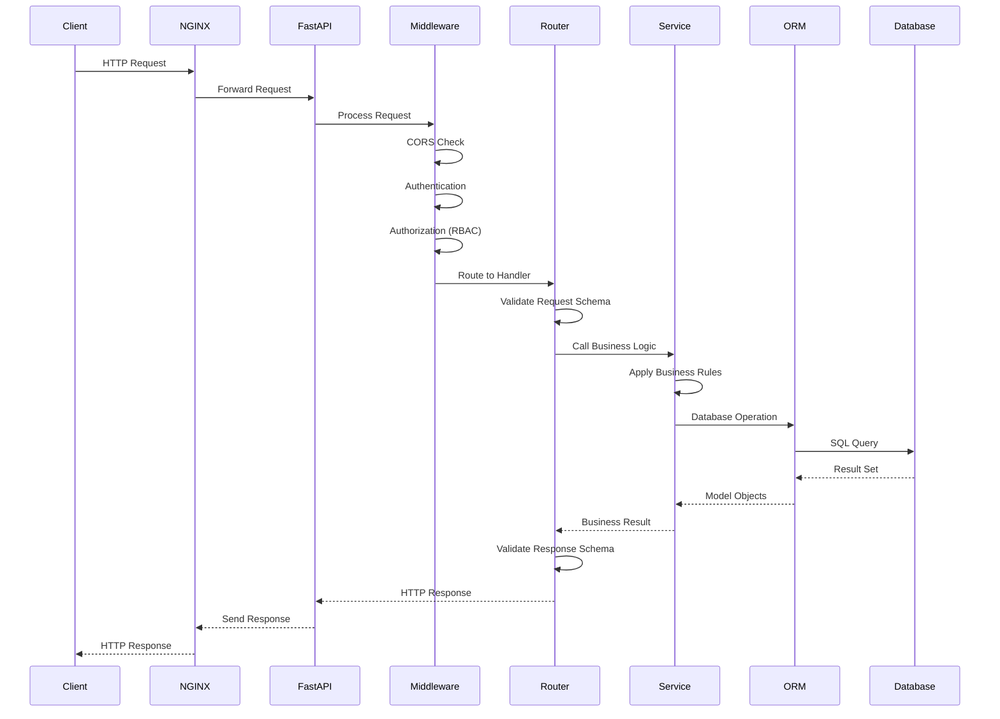
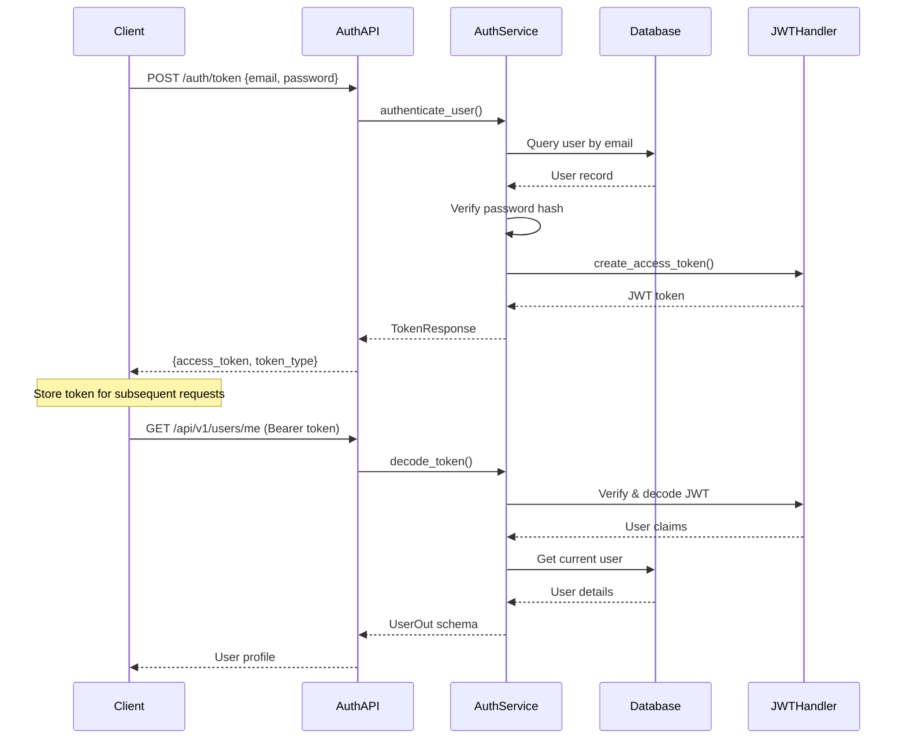
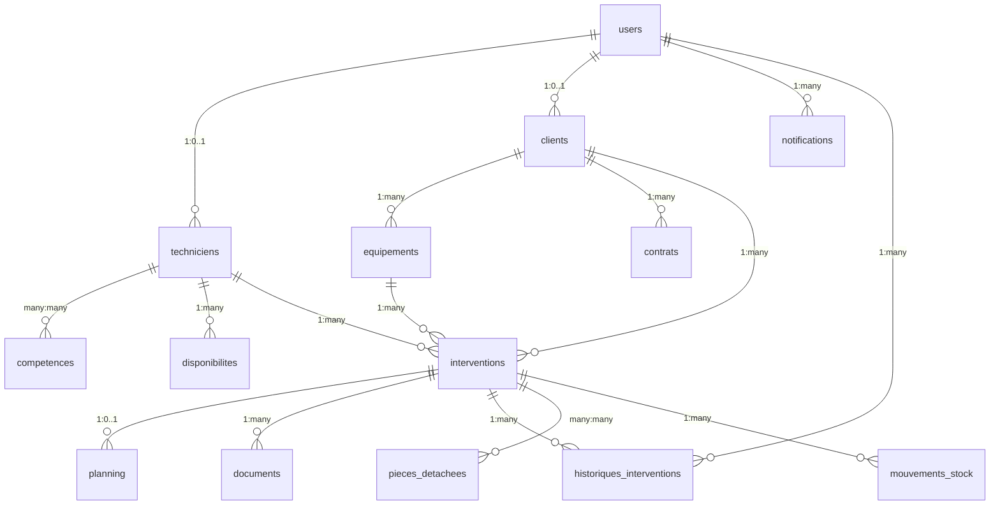

# ERP MIF Maroc - System Architecture

## Architecture Overview

The ERP MIF Maroc backend follows a **Layered Architecture** pattern with clear separation of concerns, enabling maintainability, testability, and scalability. The system is built on modern Python technologies with emphasis on type safety, async performance, and clean code principles.

## High-Level Architecture

```mermaid
graph TB
    subgraph "Client Layer"
        WEB[Web Frontend]
        MOBILE[Mobile App]
        API_CLIENT[API Clients]
    end
    
    subgraph "API Gateway Layer"
        NGINX[Nginx Proxy]
        CORS[CORS Middleware]
        AUTH_MW[Auth Middleware]
        RATE_LIMIT[Rate Limiting]
    end
    
    subgraph "Application Layer"
        FASTAPI[FastAPI Framework]
        
        subgraph "API Routes"
            AUTH_API[Authentication API]
            BUSINESS_API[Business APIs]
            ADMIN_API[Administration API]
        end
        
        subgraph "Middleware Stack"
            RBAC[RBAC Authorization]
            VALIDATION[Request Validation]
            ERROR_HANDLER[Error Handling]
            LOGGING[Request Logging]
        end
    end
    
    subgraph "Business Logic Layer"
        subgraph "Services"
            AUTH_SVC[Auth Service]
            USER_SVC[User Service]
            TECH_SVC[Technician Service]
            CLIENT_SVC[Client Service]
            EQUIP_SVC[Equipment Service]
            INTERV_SVC[Intervention Service]
            PLAN_SVC[Planning Service]
            NOTIF_SVC[Notification Service]
            DOC_SVC[Document Service]
        end
        
        subgraph "Background Tasks"
            SCHEDULER[APScheduler]
            TASK_QUEUE[Task Queue]
            CRON_JOBS[Cron Jobs]
        end
    end
    
    subgraph "Data Access Layer"
        subgraph "ORM"
            SQLALCHEMY[SQLAlchemy 2.x]
            MODELS[Domain Models]
            RELATIONSHIPS[ORM Relations]
        end
        
        subgraph "Data Validation"
            PYDANTIC[Pydantic Schemas]
            VALIDATORS[Custom Validators]
        end
        
        subgraph "Database Management"
            ALEMBIC[Alembic Migrations]
            SEEDING[Data Seeding]
        end
    end
    
    subgraph "Infrastructure Layer"
        subgraph "Primary Storage"
            POSTGRES[(PostgreSQL)]
            FILE_STORAGE[File Storage]
        end
        
        subgraph "External Services"
            SMTP[SMTP Server]
            REDIS[(Redis Cache)]
        end
        
        subgraph "Monitoring"
            LOGS[Application Logs]
            METRICS[Performance Metrics]
            HEALTH[Health Checks]
        end
    end
    
    WEB --> NGINX
    MOBILE --> NGINX
    API_CLIENT --> NGINX
    
    NGINX --> FASTAPI
    CORS --> AUTH_MW
    AUTH_MW --> RATE_LIMIT
    
    FASTAPI --> AUTH_API
    FASTAPI --> BUSINESS_API
    FASTAPI --> ADMIN_API
    
    AUTH_API --> RBAC
    BUSINESS_API --> RBAC
    ADMIN_API --> RBAC
    
    RBAC --> VALIDATION
    VALIDATION --> ERROR_HANDLER
    ERROR_HANDLER --> LOGGING
    
    AUTH_API --> AUTH_SVC
    BUSINESS_API --> USER_SVC
    BUSINESS_API --> TECH_SVC
    BUSINESS_API --> CLIENT_SVC
    BUSINESS_API --> EQUIP_SVC
    BUSINESS_API --> INTERV_SVC
    BUSINESS_API --> PLAN_SVC
    BUSINESS_API --> NOTIF_SVC
    BUSINESS_API --> DOC_SVC
    
    SCHEDULER --> TASK_QUEUE
    TASK_QUEUE --> CRON_JOBS
    
    AUTH_SVC --> SQLALCHEMY
    USER_SVC --> SQLALCHEMY
    TECH_SVC --> SQLALCHEMY
    CLIENT_SVC --> SQLALCHEMY
    EQUIP_SVC --> SQLALCHEMY
    INTERV_SVC --> SQLALCHEMY
    PLAN_SVC --> SQLALCHEMY
    NOTIF_SVC --> SQLALCHEMY
    DOC_SVC --> SQLALCHEMY
    
    SQLALCHEMY --> MODELS
    MODELS --> RELATIONSHIPS
    
    PYDANTIC --> VALIDATORS
    
    SQLALCHEMY --> POSTGRES
    ALEMBIC --> POSTGRES
    SEEDING --> POSTGRES
    
    DOC_SVC --> FILE_STORAGE
    NOTIF_SVC --> SMTP
    USER_SVC --> REDIS
    
    FASTAPI --> LOGS
    FASTAPI --> METRICS
    FASTAPI --> HEALTH
```



## Architectural Patterns

### 1. Layered Architecture

**Presentation Layer (API)**
- FastAPI routers with explicit route definitions
- Pydantic schemas for request/response validation
- OpenAPI automatic documentation generation
- CORS and authentication middleware

**Business Logic Layer (Services)**
- Service classes with domain-specific operations
- Business rule enforcement and validation
- Transaction management and data integrity
- Cross-cutting concerns (logging, caching)

**Data Access Layer (ORM)**
- SQLAlchemy models with relationships
- Repository pattern through ORM queries
- Database connection pooling and optimization
- Migration management with Alembic

**Infrastructure Layer**
- PostgreSQL primary database
- File system for document storage
- SMTP for email notifications
- Redis for caching and sessions

### 2. Dependency Injection

```python
# Example: Service dependency injection
@router.post("/interventions/")
def create_intervention(
    intervention_data: InterventionCreate,
    db: Session = Depends(get_db),
    current_user: dict = Depends(get_current_user)
):
    return intervention_service.create(db, intervention_data, current_user)
```

**Benefits:**
- Testable code through mock injection
- Loose coupling between components
- Configuration through dependency providers
- Clean separation of concerns

### 3. Repository Pattern (via ORM)

```python
# Model definition with relationships
class Intervention(Base):
    __tablename__ = "interventions"
    
    # Relationships with automatic loading strategies
    equipement = relationship("Equipement", back_populates="interventions")
    technicien = relationship("Technicien", back_populates="interventions")
    client = relationship("Client", back_populates="interventions")
```

## Component Architecture

### API Layer Components

**FastAPI Application (`app/main.py`)**
```python
app = FastAPI(
    title=settings.PROJECT_NAME,
    version="1.0.0",
    description="Backend ERP pour la gestion des interventions industrielles",
    lifespan=lifespan,
)

# Middleware stack
app.add_middleware(CORSMiddleware, ...)

# Router inclusion with versioning
app.include_router(auth.router, prefix="/api/v1")
app.include_router(users.router, prefix="/api/v1")
# ... other routers
```

**Router Organization**
- `/api/v1/auth` - Authentication and JWT token management
- `/api/v1/users` - User account operations
- `/api/v1/techniciens` - Technician management
- `/api/v1/clients` - Client relationship management
- `/api/v1/equipements` - Equipment inventory
- `/api/v1/interventions` - Maintenance interventions
- `/api/v1/planning` - Scheduling and calendar
- `/api/v1/notifications` - Real-time messaging
- `/api/v1/documents` - File management
- `/api/v1/filters` - Advanced search

### Service Layer Components

**Service Architecture Pattern**
```python
class InterventionService:
    def create(self, db: Session, intervention_data: InterventionCreate, user: dict):
        # Business logic implementation
        # Validation, authorization, persistence
        
    def update_status(self, db: Session, intervention_id: int, status: StatutIntervention):
        # Status transition validation
        # Business rules enforcement
        
    def assign_technician(self, db: Session, intervention_id: int, technician_id: int):
        # Assignment logic
        # Availability checking
```

**Service Responsibilities:**
- Business rule enforcement
- Data validation and transformation
- Transaction coordination
- Cross-service communication
- Error handling and logging

### Data Layer Components

**SQLAlchemy Models (`app/models/`)**
```python
# Modern SQLAlchemy 2.x with type hints
class User(Base):
    __tablename__ = "users"
    
    id = Column(Integer, primary_key=True, index=True)
    username = Column(String(100), unique=True, index=True, nullable=False)
    email = Column(String(255), unique=True, index=True, nullable=False)
    role = Column(Enum(UserRole), nullable=False, index=True)
    
    # Optimized relationships
    technicien = relationship("Technicien", back_populates="user", lazy="select")
    client = relationship("Client", back_populates="user", lazy="select")
```

**Pydantic Schemas (`app/schemas/`)**
```python
# Request/Response validation with Pydantic v2
class InterventionCreate(BaseModel):
    equipement_id: int = Field(..., description="ID de l'équipement")
    type_intervention: InterventionType
    priorite: PrioriteIntervention = PrioriteIntervention.normale
    description: str = Field(..., min_length=10, max_length=2000)
    
    model_config = ConfigDict(
        json_schema_extra={
            "example": {
                "equipement_id": 1,
                "type_intervention": "corrective",
                "priorite": "haute",
                "description": "Maintenance corrective urgente"
            }
        }
    )
```

## Data Flow Architecture

### Request Processing Flow



### Authentication Flow



## Database Architecture

### Entity Relationship Design



### Database Optimization Strategies

**Indexing Strategy**
```sql
-- High-performance indexes on frequently queried columns
CREATE INDEX idx_user_email_active ON users(email, is_active);
CREATE INDEX idx_intervention_status_date ON interventions(statut, date_creation);
CREATE INDEX idx_equipement_client_status ON equipements(client_id, statut);
```

**Relationship Loading Optimization**
```python
# Lazy loading strategies for performance
interventions = relationship(
    "Intervention", 
    back_populates="client",
    lazy="dynamic",  # For large collections
    order_by="desc(Intervention.date_creation)"
)

equipement = relationship(
    "Equipement", 
    back_populates="interventions",
    lazy="select"  # For single object loading
)
```

## Security Architecture

### Authentication & Authorization

**JWT Token Structure**
```json
{
  "sub": "user@example.com",
  "user_id": 123,
  "role": "technicien",
  "exp": 1640995200,
  "iat": 1640991600
}
```

**RBAC Implementation**
```python
def require_roles(*roles: str):
    def role_dependency(current_user: dict = Depends(get_current_user)):
        if current_user["role"] not in roles:
            raise HTTPException(status_code=403, detail="Insufficient permissions")
        return current_user
    return role_dependency

# Usage in routes
@router.get("/admin/users", dependencies=[Depends(require_roles("admin"))])
```

### Input Validation Architecture

**Multi-layer Validation**
1. **Pydantic Schema Validation**: Type checking, field constraints
2. **Business Rule Validation**: Domain-specific rules in services
3. **Database Constraints**: Foreign keys, unique constraints
4. **RBAC Authorization**: Role-based access control

## Performance Architecture

### Caching Strategy

**Application-level Caching**
- User session caching with Redis
- Frequently accessed configuration data
- Query result caching for expensive operations

**Database Optimization**
- Connection pooling with SQLAlchemy
- Optimized query patterns with lazy loading
- Index optimization for common queries

### Async Architecture

**FastAPI Async Support**
```python
@router.get("/interventions/")
async def list_interventions(
    db: AsyncSession = Depends(get_async_db)
):
    # Async database operations
    result = await db.execute(select(Intervention))
    return result.scalars().all()
```

## Monitoring & Observability

### Logging Architecture

**Structured Logging**
```python
import logging
logger = logging.getLogger(__name__)

# Request/response logging
logger.info("Intervention created", extra={
    "intervention_id": intervention.id,
    "user_id": current_user["user_id"],
    "equipment_id": intervention.equipement_id
})
```

**Health Check Implementation**
```python
@app.get("/health")
def health_check():
    return {
        "status": "ok",
        "timestamp": datetime.now().isoformat(),
        "version": "1.0.0"
    }
```

## Deployment Architecture

### Container Architecture

**Docker Composition**
```yaml
services:
  api:
    build: .
    environment:
      - DATABASE_URL=postgresql://...
      - JWT_SECRET_KEY=${JWT_SECRET_KEY}
    depends_on:
      - db
      
  db:
    image: postgres:16
    environment:
      - POSTGRES_DB=erp_db
      - POSTGRES_USER=erp_user
      - POSTGRES_PASSWORD=erp_pass
    volumes:
      - postgres_data:/var/lib/postgresql/data
```

### Environment Configuration

**Configuration Management**
```python
class Settings(BaseSettings):
    PROJECT_NAME: str = "ERP Interventions"
    API_V1_STR: str = "/api/v1"
    SECRET_KEY: str = Field(default="insecure-test-secret-key")
    DATABASE_URL: str = Field(...)
    
    model_config = SettingsConfigDict(
        env_file=".env",
        env_file_encoding="utf-8"
    )
```

## Scalability Considerations

### Horizontal Scaling

- **Stateless API Design**: No server-side session storage
- **Database Connection Pooling**: Efficient resource utilization
- **Load Balancer Ready**: Multiple API instance support

### Vertical Scaling

- **Async Request Handling**: High concurrency support
- **Optimized Database Queries**: Minimal resource usage
- **Efficient Memory Management**: SQLAlchemy session handling

## Error Handling Architecture

### Exception Hierarchy

```python
class ERPException(Exception):
    """Base exception for ERP-specific errors"""
    
class ValidationError(ERPException):
    """Data validation errors"""
    
class AuthorizationError(ERPException):
    """Access control errors"""
    
class BusinessRuleError(ERPException):
    """Business logic violations"""
```

### Error Response Format

```json
{
  "detail": "Validation error",
  "errors": [
    {
      "field": "email",
      "message": "Invalid email format",
      "code": "INVALID_EMAIL"
    }
  ],
  "timestamp": "2025-01-27T10:00:00Z"
}
```

---

*This architecture documentation provides the foundation for understanding the ERP MIF Maroc system design. For implementation details, refer to the specific service and component documentation.*