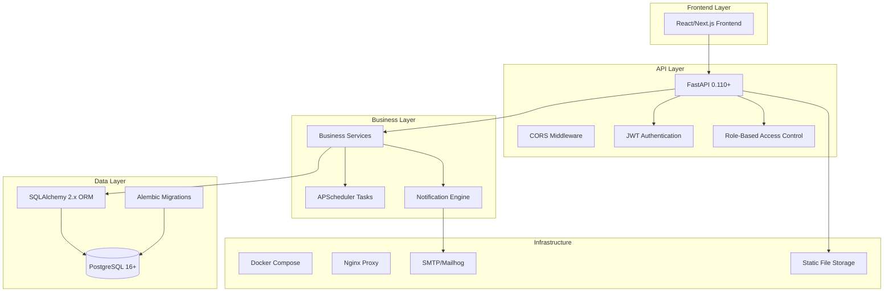
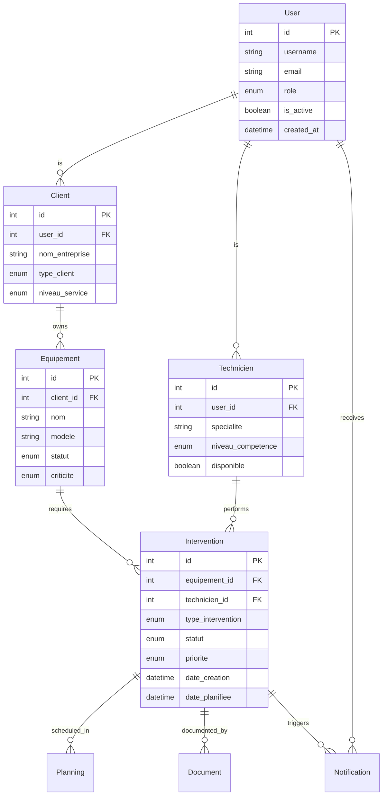

# ERP MIF Maroc - Project Overview

## Project Context

**ERP MIF Maroc** is a comprehensive Enterprise Resource Planning system specifically designed for industrial maintenance management in Morocco. This FastAPI-based backend provides a robust foundation for managing maintenance interventions, equipment tracking, technician scheduling, and client relationships.

### Project Mission

Transform industrial maintenance operations through:
- **Predictive Maintenance**: Proactive equipment monitoring and intervention scheduling
- **Resource Optimization**: Efficient technician allocation and planning
- **Client Excellence**: Comprehensive service delivery and satisfaction tracking
- **Business Intelligence**: Real-time insights and performance analytics

## Technical Stack



### Core Technologies

| Component | Technology | Version | Purpose |
|-----------|------------|---------|---------|
| **Web Framework** | FastAPI | 0.110+ | High-performance async API framework |
| **Database** | PostgreSQL | 16+ | Primary data store with ACID compliance |
| **ORM** | SQLAlchemy | 2.x | Modern async ORM with type safety |
| **Migrations** | Alembic | Latest | Database schema versioning |
| **Authentication** | JWT + RBAC | - | Secure token-based authentication |
| **Validation** | Pydantic | 2.6+ | Request/response validation |
| **Scheduling** | APScheduler | Latest | Background task execution |
| **Testing** | Pytest | Latest | Comprehensive test suite (97%+ coverage) |
| **Containerization** | Docker Compose | Latest | Development and deployment |

## Business Domain Model

### Core Entities



### Role-Based Access Control (RBAC)

| Role | Description | Permissions |
|------|-------------|------------|
| **admin** | System administrator | Full system access, user management, configuration |
| **responsable** | Operations manager | Intervention oversight, planning, reporting |
| **technicien** | Field technician | Own interventions, equipment updates, time tracking |
| **client** | External client | Own equipment view, intervention requests, documents |

## API Architecture

### API Versioning Strategy

- **Base URL**: `http://localhost:8000`
- **API Prefix**: `/api/v1`
- **Versioned Endpoints**: All business endpoints under `/api/v1`
- **Legacy Support**: Root-level endpoints for backward compatibility

### Endpoint Organization

| Service Domain | Prefix | Purpose |
|----------------|--------|---------|
| Authentication | `/api/v1/auth` | JWT token management, login |
| Users | `/api/v1/users` | User account management |
| Technicians | `/api/v1/techniciens` | Technician profiles and competencies |
| Clients | `/api/v1/clients` | Client organizations and contacts |
| Equipment | `/api/v1/equipements` | Equipment inventory and status |
| Interventions | `/api/v1/interventions` | Maintenance interventions |
| Planning | `/api/v1/planning` | Scheduling and calendar |
| Notifications | `/api/v1/notifications` | Real-time messaging |
| Documents | `/api/v1/documents` | File uploads and management |
| Filters | `/api/v1/filters` | Advanced search and filtering |

### Request/Response Standards

- **Content Type**: `application/json` (forms for auth endpoints)
- **Authentication**: `Authorization: Bearer <jwt_token>`
- **Error Format**: `{"detail": "Error message"}` 
- **Pagination**: `limit` and `offset` parameters
- **Filtering**: Query parameters with type validation

## Development Workflow

### Environment Setup

1. **Development**: Docker Compose with hot reload
2. **Testing**: In-memory SQLite for test isolation
3. **Production**: PostgreSQL with proper migrations

### Code Quality Standards

- **Coverage Target**: 90%+ test coverage (currently 97.27%)
- **Code Style**: Black formatter, isort imports, flake8 linting
- **Type Safety**: Full type hints with Pydantic validation
- **Documentation**: Comprehensive docstrings and API docs

### Testing Strategy

- **Unit Tests**: Service layer and business logic
- **Integration Tests**: API endpoints and database operations
- **Contract Tests**: OpenAPI specification compliance
- **Performance Tests**: Load testing for critical paths

## Deployment Architecture

### Docker Compose Services

```yaml
services:
  api:          # FastAPI application
  db:           # PostgreSQL database
  mailhog:      # SMTP testing server
  nginx:        # Reverse proxy (production)
```

### Environment Configuration

| Environment | Database | Authentication | File Storage |
|-------------|----------|---------------|--------------|
| **Development** | Docker PostgreSQL | Test JWT keys | Local uploads |
| **Testing** | SQLite in-memory | Mock authentication | Temporary files |
| **Production** | Managed PostgreSQL | Secure JWT keys | Cloud storage |

## Business Metrics & KPIs

### Operational Metrics

- **Intervention Response Time**: Average time from request to assignment
- **Equipment Availability**: Percentage of operational equipment
- **Technician Utilization**: Resource allocation efficiency
- **Client Satisfaction**: Service quality ratings
- **Maintenance Costs**: Financial performance tracking

### Technical Metrics

- **API Performance**: Response times and throughput
- **System Availability**: Uptime and reliability
- **Error Rates**: Application stability metrics
- **Resource Usage**: Infrastructure optimization

## Integration Points

### External Systems

- **SMTP Server**: Email notifications and alerts
- **File Storage**: Document and image management
- **Frontend Application**: React/Next.js client interface
- **Reporting Tools**: Business intelligence integration

### WebSocket Channels

- Real-time intervention updates
- Technician status notifications  
- Equipment alert broadcasts
- Client communication channels

## Security Considerations

### Authentication & Authorization

- JWT tokens with configurable expiration
- Role-based permissions with granular control
- Secure password hashing with bcrypt
- API endpoint protection with dependency injection

### Data Protection

- Input validation with Pydantic schemas
- SQL injection prevention through ORM
- CORS configuration for frontend integration
- Secure file upload handling

## Future Roadmap

### Phase 1 (Current)
- ✅ Core ERP functionality
- ✅ Basic RBAC implementation
- ✅ Equipment and intervention management

### Phase 2 (Q2 2025)
- 🔄 Advanced analytics and reporting
- 🔄 Mobile application support
- 🔄 IoT equipment integration

### Phase 3 (Q3 2025)
- 📋 Predictive maintenance AI
- 📋 Supply chain integration
- 📋 Multi-tenant architecture

## Contact & Support

- **Development Team**: backend-team@mif-maroc.com
- **Author**: Sabir Rochdi - MIF Maroc
- **Repository**: [FastApi_ERP_BackEnd_MIF_Maroc](https://github.com/Rochdi112/FastApi_ERP_BackEnd_MIF_Maroc)
- **Documentation**: Available at `/docs` (Swagger) and `/redoc`

---

*This document provides a comprehensive overview of the ERP MIF Maroc backend system. For detailed technical information, refer to the specific documentation in each section.*