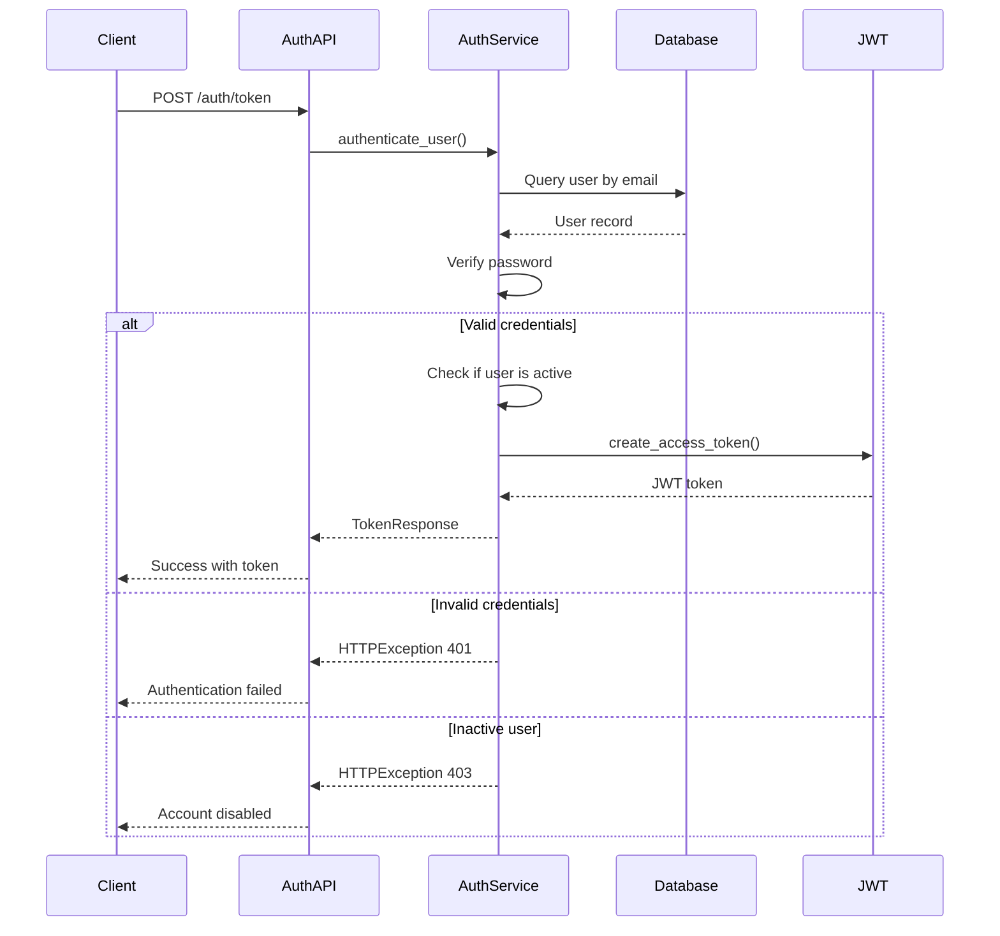

# ERP MIF Maroc - Authentication Service

## Service Overview

The Authentication Service manages user authentication, JWT token generation, and session management for the ERP MIF Maroc system. It provides secure login capabilities with multiple authentication methods and robust token validation.

## Scope and Responsibilities

### Core Responsibilities
- **User Authentication**: Validate user credentials (email/password, username/password)
- **JWT Token Management**: Generate, validate, and refresh JWT tokens
- **Session Management**: Handle user sessions and token lifecycle
- **Security Enforcement**: Implement password policies and security measures
- **Audit Logging**: Track authentication events for security monitoring

### Business Rules
- Only active users can authenticate
- Failed login attempts are logged for security monitoring
- JWT tokens have configurable expiration times
- Multiple authentication methods supported (email and username)
- Role information embedded in JWT for authorization

## Data Models

### Entities & Schema Mapping

| Database Model | SQLAlchemy Model | Pydantic Schema | Purpose |
|----------------|------------------|-----------------|---------|
| `users` | `User` | `UserOut`, `UserCreate` | User account information |
| N/A | N/A | `TokenResponse` | JWT token response |
| N/A | N/A | `LoginRequest` | Authentication request |

### Core Models

**User Model (Authentication Fields)**
```python
class User(Base):
    __tablename__ = "users"
    
    id = Column(Integer, primary_key=True, index=True)
    username = Column(String(100), unique=True, index=True, nullable=False)
    email = Column(String(255), unique=True, index=True, nullable=False)
    hashed_password = Column(String(255), nullable=False)
    role = Column(Enum(UserRole), nullable=False, index=True)
    is_active = Column(Boolean, default=True, nullable=False)
    created_at = Column(DateTime, default=datetime.utcnow)
    updated_at = Column(DateTime, default=datetime.utcnow, onupdate=datetime.utcnow)
```

**Authentication Schemas**
```python
class TokenResponse(BaseModel):
    access_token: str = Field(..., description="JWT access token")
    token_type: str = Field(default="bearer", description="Token type")
    
class LoginRequest(BaseModel):
    email: Optional[str] = Field(None, description="User email")
    username: Optional[str] = Field(None, description="Username")
    password: str = Field(..., description="User password")
```

## API Endpoints

### Endpoint Matrix

| Method | URL | Auth | Roles | Body | Query | Response | Status Codes |
|--------|-----|------|-------|------|-------|----------|--------------|
| POST | `/api/v1/auth/token` | None | None | Form data | None | `TokenResponse` | 200, 401, 403 |
| POST | `/api/v1/auth/login` | None | None | Form data | None | `TokenResponse` | 200, 401, 403 |
| GET | `/api/v1/auth/me` | Bearer | All | None | None | `UserOut` | 200, 401, 403 |

### Endpoint Details

**POST /api/v1/auth/token - Email Authentication**
```python
@router.post(
    "/token",
    response_model=TokenResponse,
    summary="Connexion utilisateur",
    description="Authentifie un utilisateur avec email + mot de passe. Retourne un token JWT si valide."
)
def login(
    email: str = Form(...),
    password: str = Form(...),
    db: Session = Depends(get_db)
):
    """
    Authenticate user with email and password.
    Returns JWT token for API access.
    """
    return authenticate_user(db, email, password)
```

**POST /api/v1/auth/login - Username Authentication**
```python
@router.post(
    "/login",
    response_model=TokenResponse,
    summary="Connexion utilisateur (username/password)",
    description="Authentifie un utilisateur avec username + mot de passe. Retourne un token JWT si valide."
)
def login_username(
    username: str = Form(...),
    password: str = Form(...),
    db: Session = Depends(get_db)
):
    """
    Authenticate user with username and password.
    Alternative authentication method for compatibility.
    """
    return authenticate_user_by_username(db, username, password)
```

**GET /api/v1/auth/me - Current User Profile**
```python
@router.get(
    "/me",
    response_model=UserOut,
    summary="Profil utilisateur actuel",
    description="Retourne les informations du profil de l'utilisateur connecté."
)
def get_current_user_profile(
    current_user: dict = Depends(get_current_user),
    db: Session = Depends(get_db)
):
    """
    Get current authenticated user profile.
    Requires valid JWT token.
    """
    user = db.query(User).filter(User.id == current_user["user_id"]).first()
    if not user:
        raise HTTPException(status_code=404, detail="User not found")
    return user
```

## Business Logic Implementation

### Authentication Flow



### Authentication Service Implementation

```python
def authenticate_user(db: Session, email: str, password: str) -> TokenResponse:
    """
    Authenticate user with email and password.
    
    Args:
        db: Database session
        email: User email address
        password: Plain text password
    
    Returns:
        TokenResponse: JWT token and type
    
    Raises:
        HTTPException: 401 for invalid credentials, 403 for disabled account
    """
    # Query user by email
    user = db.query(User).filter(User.email == email).first()

    # Verify user exists and password is correct
    if not user or not verify_password(password, user.hashed_password):
        raise HTTPException(
            status_code=status.HTTP_401_UNAUTHORIZED,
            detail="Email ou mot de passe incorrect"
        )

    # Check if account is active
    if not user.is_active:
        raise HTTPException(
            status_code=status.HTTP_403_FORBIDDEN,
            detail="Compte désactivé"
        )

    # Create JWT token with user claims
    access_token = create_access_token(
        data={
            "sub": user.email,      # Subject (RFC 7519 standard)
            "role": user.role,      # User role for RBAC
            "user_id": user.id      # Internal user ID
        }
    )

    return TokenResponse(access_token=access_token, token_type="bearer")

def authenticate_user_by_username(db: Session, username: str, password: str) -> TokenResponse:
    """
    Authenticate user with username and password.
    Alternative authentication method for compatibility.
    """
    user = db.query(User).filter(User.username == username).first()
    
    if not user or not verify_password(password, user.hashed_password):
        raise HTTPException(
            status_code=status.HTTP_401_UNAUTHORIZED,
            detail="Username ou mot de passe incorrect"
        )
    
    if not user.is_active:
        raise HTTPException(
            status_code=status.HTTP_403_FORBIDDEN,
            detail="Compte désactivé"
        )
    
    access_token = create_access_token(
        data={
            "sub": user.username,
            "role": user.role,
            "user_id": user.id
        }
    )
    
    return TokenResponse(access_token=access_token, token_type="bearer")
```

### JWT Token Management

```python
def create_access_token(data: dict, expires_delta: timedelta = None) -> str:
    """
    Create JWT access token with user data and expiration.
    
    Args:
        data: Token payload data
        expires_delta: Custom token expiration time
    
    Returns:
        str: Encoded JWT token
    """
    to_encode = data.copy()
    
    if expires_delta:
        expire = datetime.utcnow() + expires_delta
    else:
        expire = datetime.utcnow() + timedelta(minutes=settings.ACCESS_TOKEN_EXPIRE_MINUTES)
    
    to_encode.update({
        "exp": expire,      # Expiration time
        "iat": datetime.utcnow()  # Issued at time
    })
    
    encoded_jwt = jwt.encode(to_encode, settings.SECRET_KEY, algorithm=settings.ALGORITHM)
    return encoded_jwt

def decode_token(token: str) -> dict:
    """
    Decode and verify JWT token.
    
    Args:
        token: JWT token string
    
    Returns:
        dict: Token payload
    
    Raises:
        HTTPException: 403 for invalid or expired tokens
    """
    try:
        return jwt.decode(token, settings.SECRET_KEY, algorithms=[settings.ALGORITHM])
    except JWTError:
        raise HTTPException(
            status_code=status.HTTP_403_FORBIDDEN,
            detail="Token invalide ou expiré"
        )
```

## Request/Response Examples

### Authentication Request Examples

**Email Authentication**
```bash
curl -X POST "http://localhost:8000/api/v1/auth/token" \
     -H "Content-Type: application/x-www-form-urlencoded" \
     -d "email=admin@example.com&password=admin123"
```

**Username Authentication**
```bash
curl -X POST "http://localhost:8000/api/v1/auth/login" \
     -H "Content-Type: application/x-www-form-urlencoded" \
     -d "username=admin&password=admin123"
```

**Current User Profile**
```bash
curl -H "Authorization: Bearer <token>" \
     "http://localhost:8000/api/v1/auth/me"
```

### Response Examples

**Successful Authentication**
```json
{
  "access_token": "eyJhbGciOiJIUzI1NiIsInR5cCI6IkpXVCJ9.eyJzdWIiOiJhZG1pbkBleGFtcGxlLmNvbSIsInJvbGUiOiJhZG1pbiIsInVzZXJfaWQiOjEsImV4cCI6MTY0MDk5NTIwMCwiaWF0IjoxNjQwOTkxNjAwfQ.signature",
  "token_type": "bearer"
}
```

**Current User Profile Response**
```json
{
  "id": 1,
  "username": "admin",
  "full_name": "Administrator",
  "email": "admin@example.com",
  "role": "admin",
  "is_active": true,
  "created_at": "2025-01-01T00:00:00Z",
  "updated_at": "2025-01-27T10:00:00Z"
}
```

**Authentication Error**
```json
{
  "detail": "Email ou mot de passe incorrect"
}
```

**Account Disabled Error**
```json
{
  "detail": "Compte désactivé"
}
```

## Error Handling

### Authentication Errors

| Error Code | HTTP Status | Description | Resolution |
|------------|-------------|-------------|------------|
| `INVALID_CREDENTIALS` | 401 | Wrong email/password | Verify credentials |
| `ACCOUNT_DISABLED` | 403 | User account is inactive | Contact administrator |
| `INVALID_TOKEN` | 403 | JWT token is invalid/expired | Re-authenticate |
| `MISSING_TOKEN` | 401 | No authorization header | Provide valid token |

### Error Response Format

```json
{
  "detail": "Error description",
  "code": "ERROR_CODE",
  "timestamp": "2025-01-27T10:00:00Z"
}
```

## Security Considerations

### Password Security
- **Hashing**: bcrypt with configurable rounds (default: 12)
- **Salt**: Automatic salt generation for each password
- **Verification**: Constant-time comparison to prevent timing attacks

### JWT Security
- **Algorithm**: HMAC SHA-256 (HS256)
- **Secret**: Configurable secret key (must be changed for production)
- **Expiration**: Configurable token lifetime (default: 60 minutes)
- **Claims**: Standard JWT claims (sub, exp, iat) plus custom claims (role, user_id)

### Rate Limiting (Recommended)
```python
# Future enhancement: Rate limiting for authentication endpoints
from slowapi import Limiter, _rate_limit_exceeded_handler
from slowapi.util import get_remote_address

limiter = Limiter(key_func=get_remote_address)

@router.post("/token")
@limiter.limit("5/minute")  # 5 attempts per minute per IP
def login(request: Request, ...):
    pass
```

## Testing

### Unit Tests

```python
def test_authenticate_valid_user():
    """Test successful authentication with valid credentials."""
    response = client.post("/api/v1/auth/token", data={
        "email": "test@example.com",
        "password": "validpassword"
    })
    assert response.status_code == 200
    data = response.json()
    assert "access_token" in data
    assert data["token_type"] == "bearer"

def test_authenticate_invalid_email():
    """Test authentication failure with invalid email."""
    response = client.post("/api/v1/auth/token", data={
        "email": "nonexistent@example.com",
        "password": "password"
    })
    assert response.status_code == 401
    assert "Email ou mot de passe incorrect" in response.json()["detail"]

def test_authenticate_wrong_password():
    """Test authentication failure with wrong password."""
    response = client.post("/api/v1/auth/token", data={
        "email": "test@example.com",
        "password": "wrongpassword"
    })
    assert response.status_code == 401

def test_authenticate_inactive_user():
    """Test authentication failure for inactive user."""
    # Create inactive user
    inactive_user = create_test_user(is_active=False)
    
    response = client.post("/api/v1/auth/token", data={
        "email": inactive_user.email,
        "password": "password"
    })
    assert response.status_code == 403
    assert "Compte désactivé" in response.json()["detail"]

def test_get_current_user_valid_token():
    """Test getting current user with valid token."""
    token = create_test_token(user_id=1, role="admin")
    headers = {"Authorization": f"Bearer {token}"}
    
    response = client.get("/api/v1/auth/me", headers=headers)
    assert response.status_code == 200
    data = response.json()
    assert data["id"] == 1
    assert data["role"] == "admin"

def test_get_current_user_invalid_token():
    """Test getting current user with invalid token."""
    headers = {"Authorization": "Bearer invalid_token"}
    
    response = client.get("/api/v1/auth/me", headers=headers)
    assert response.status_code == 403
```

### Integration Tests

```python
def test_complete_authentication_flow():
    """Test complete authentication and authorization flow."""
    # 1. Create user
    user_data = {
        "username": "testuser",
        "email": "test@example.com",
        "password": "testpassword",
        "role": "technicien"
    }
    create_user_response = client.post("/api/v1/users/", json=user_data)
    assert create_user_response.status_code == 201
    
    # 2. Authenticate
    auth_response = client.post("/api/v1/auth/token", data={
        "email": "test@example.com",
        "password": "testpassword"
    })
    assert auth_response.status_code == 200
    token = auth_response.json()["access_token"]
    
    # 3. Access protected resource
    headers = {"Authorization": f"Bearer {token}"}
    profile_response = client.get("/api/v1/auth/me", headers=headers)
    assert profile_response.status_code == 200
    assert profile_response.json()["email"] == "test@example.com"
    
    # 4. Access role-protected resource
    interventions_response = client.get("/api/v1/interventions/", headers=headers)
    assert interventions_response.status_code == 200
```

## Performance Considerations

### Optimization Strategies
- **Password Hashing**: Use appropriate bcrypt rounds (balance security vs performance)
- **Database Queries**: Index on email and username fields for fast lookups
- **Token Validation**: JWT validation is stateless and fast
- **Caching**: Consider caching user data for frequently accessed profiles

### Monitoring Metrics
- **Authentication Rate**: Successful/failed login attempts per minute
- **Token Generation Time**: JWT token creation latency
- **Database Query Time**: User lookup performance
- **Error Rate**: Authentication failure rate by error type

## Configuration

### Environment Variables

```bash
# JWT Configuration
SECRET_KEY="your-256-bit-secret-key"    # CRITICAL: Change for production
ALGORITHM="HS256"                       # JWT algorithm
ACCESS_TOKEN_EXPIRE_MINUTES=60          # Token validity in minutes

# Password Security
BCRYPT_ROUNDS=12                        # bcrypt cost factor

# Database
DATABASE_URL="postgresql://..."         # Database connection string
```

### Security Configuration

```python
# app/core/config.py
class Settings(BaseSettings):
    SECRET_KEY: str = Field(default="insecure-test-secret-key")
    ALGORITHM: str = "HS256"
    ACCESS_TOKEN_EXPIRE_MINUTES: int = 60
    
    @field_validator('SECRET_KEY')
    def validate_secret_key(cls, v):
        if v == "insecure-test-secret-key" and os.getenv("ENV") == "production":
            raise ValueError("SECRET_KEY must be changed for production")
        return v
```

---

*This authentication service documentation provides comprehensive coverage of user authentication, JWT token management, and security implementation for the ERP MIF Maroc system.*