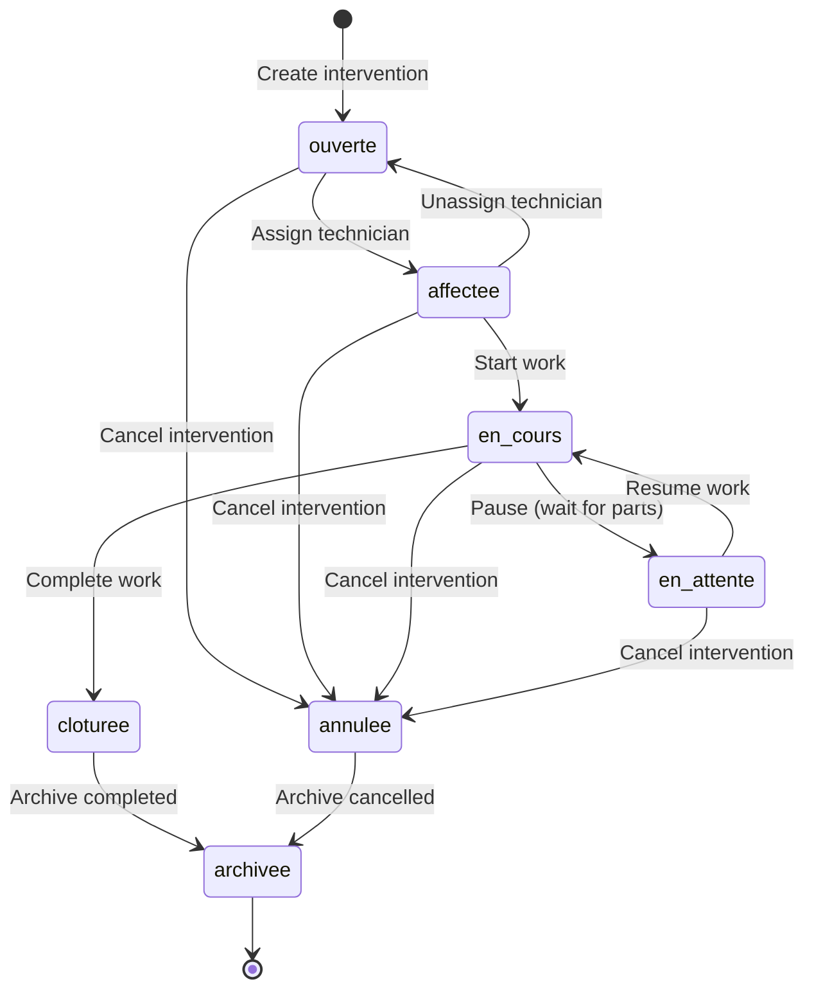

# ERP MIF Maroc - Interventions Service

## Service Overview

The Interventions Service is the **core business service** of the ERP MIF Maroc system, managing the complete lifecycle of maintenance interventions from creation to completion. It orchestrates equipment maintenance workflows, technician assignments, status tracking, and business rule enforcement.

## Scope and Responsibilities

### Core Responsibilities
- **Intervention Lifecycle Management**: Create, assign, track, and close maintenance interventions
- **Workflow Orchestration**: Enforce business rules and state transitions
- **Resource Assignment**: Manage technician allocation and availability
- **Status Tracking**: Monitor intervention progress through defined states
- **Business Rule Enforcement**: Validate intervention constraints and policies
- **Audit Trail**: Maintain complete history of intervention changes

### Business Context
Interventions represent maintenance work orders that connect:
- **Equipment** requiring maintenance
- **Clients** who own the equipment
- **Technicians** who perform the work
- **Planning** for scheduling and coordination
- **Documents** for work documentation
- **Notifications** for stakeholder communication

## Data Models

### Entities & Schema Mapping

| Database Table | SQLAlchemy Model | Pydantic Schema | Purpose |
|----------------|------------------|-----------------|---------|
| `interventions` | `Intervention` | `InterventionOut`, `InterventionCreate`, `InterventionUpdate` | Main intervention entity |
| `historiques_interventions` | `HistoriqueIntervention` | `HistoriqueOut` | Audit trail for changes |
| `planning` | `Planning` | `PlanningOut` | Scheduling information |
| `documents` | `Document` | `DocumentOut` | Related documentation |

### Core Intervention Model

```python
class Intervention(Base):
    __tablename__ = "interventions"
    
    # Primary identification
    id = Column(Integer, primary_key=True, index=True)
    titre = Column(String(255), nullable=False)
    description = Column(Text, nullable=False)
    
    # Business classification
    type_intervention = Column(Enum(InterventionType), nullable=False)
    statut = Column(Enum(StatutIntervention), default=StatutIntervention.ouverte)
    priorite = Column(Enum(PrioriteIntervention), default=PrioriteIntervention.normale)
    urgence = Column(Boolean, default=False, nullable=False)
    
    # Relationships
    equipement_id = Column(Integer, ForeignKey("equipements.id"), nullable=False)
    technicien_id = Column(Integer, ForeignKey("techniciens.id"), nullable=True)
    client_id = Column(Integer, ForeignKey("clients.id"), nullable=False)
    
    # Temporal tracking
    date_creation = Column(DateTime, default=datetime.utcnow)
    date_planifiee = Column(DateTime, nullable=True)
    date_debut = Column(DateTime, nullable=True)
    date_fin = Column(DateTime, nullable=True)
    date_limite = Column(DateTime, nullable=True)
    
    # Work details
    diagnostic = Column(Text, nullable=True)
    solution = Column(Text, nullable=True)
    duree_estimee = Column(Decimal(5,2), nullable=True)  # hours
    duree_reelle = Column(Decimal(5,2), nullable=True)   # hours
    cout_estime = Column(Decimal(10,2), nullable=True)
    cout_reel = Column(Decimal(10,2), nullable=True)
    
    # Quality metrics
    satisfaction_client = Column(Integer, nullable=True)  # 1-5 rating
    notes_techniques = Column(Text, nullable=True)
    
    # Audit fields
    created_at = Column(DateTime, default=datetime.utcnow)
    updated_at = Column(DateTime, default=datetime.utcnow, onupdate=datetime.utcnow)
```

### Intervention Enums

**InterventionType**
```python
class InterventionType(str, enum.Enum):
    corrective = "corrective"    # Reactive maintenance (breakdown repair)
    preventive = "preventive"    # Planned preventive maintenance
    ameliorative = "ameliorative" # Improvement/upgrade work
    diagnostic = "diagnostic"    # Technical analysis and diagnosis
```

**StatutIntervention (State Machine)**
```python
class StatutIntervention(str, enum.Enum):
    ouverte = "ouverte"         # Created, awaiting assignment
    affectee = "affectee"       # Assigned to technician
    en_cours = "en_cours"       # Work in progress on-site
    en_attente = "en_attente"   # Paused (waiting for parts/approval)
    cloturee = "cloturee"       # Completed and validated
    annulee = "annulee"         # Cancelled
    archivee = "archivee"       # Archived for historical purposes
```

**PrioriteIntervention**
```python
class PrioriteIntervention(str, enum.Enum):
    urgente = "urgente"         # Immediate intervention (< 2h)
    haute = "haute"             # High priority (< 24h)
    normale = "normale"         # Standard priority (< 72h)
    basse = "basse"             # Low priority (< 1 week)
    programmee = "programmee"   # Scheduled intervention
```

## State Machine & Workflow

### Intervention State Transitions



### Business Rules & Invariants

**State Transition Rules**
1. **ouverte → affectee**: Requires valid technicien_id assignment
2. **affectee → en_cours**: Sets date_debut timestamp
3. **en_cours → cloturee**: Requires date_fin and solution/diagnostic
4. **cloturee → archivee**: After validation period (configurable)
5. **Any → annulee**: Allowed with proper authorization

**Business Invariants**
- Only one intervention per technician can be "en_cours" simultaneously
- Equipment must exist and be accessible to the requesting client
- date_fin must be >= date_debut when both are set
- Urgence flag automatically sets priorite to "urgente"
- Client can only create interventions for their own equipment

## API Endpoints

### Endpoint Matrix

| Method | URL | Auth | Roles | Body | Query | Response | Status Codes |
|--------|-----|------|-------|------|-------|----------|--------------|
| GET | `/api/v1/interventions/` | Bearer | All | None | Filters | `List[InterventionOut]` | 200, 401, 403 |
| POST | `/api/v1/interventions/` | Bearer | responsable, admin | `InterventionCreate` | None | `InterventionOut` | 201, 400, 401, 403 |
| GET | `/api/v1/interventions/{id}` | Bearer | All¹ | None | None | `InterventionOut` | 200, 401, 403, 404 |
| PUT | `/api/v1/interventions/{id}` | Bearer | responsable, admin | `InterventionUpdate` | None | `InterventionOut` | 200, 400, 401, 403, 404 |
| PATCH | `/api/v1/interventions/{id}/status` | Bearer | responsable, technicien² | `StatusUpdate` | None | `InterventionOut` | 200, 400, 401, 403, 404 |
| DELETE | `/api/v1/interventions/{id}` | Bearer | admin | None | None | `None` | 204, 401, 403, 404 |

**Notes:**
1. Role-based filtering applies (see RBAC matrix below)
2. Techniciens can only update status for assigned interventions

### Detailed Endpoint Implementation

**POST /api/v1/interventions/ - Create Intervention**
```python
@router.post(
    "/", 
    response_model=InterventionOut,
    status_code=201,
    summary="Créer une intervention",
    description="Crée une nouvelle intervention de maintenance avec les détails fournis.",
    dependencies=[Depends(responsable_required)]
)
def create_new_intervention(
    data: InterventionCreate,
    db: Session = Depends(get_db),
    current_user: dict = Depends(get_current_user)
):
    """
    Create new maintenance intervention.
    
    Business Rules:
    - Equipment must exist and be accessible
    - Technician (if assigned) must exist and be available
    - Client is derived from equipment ownership
    - Creates audit trail entry
    """
    # Ensure valid user_id for audit trail
    user_id = current_user.get("user_id")
    if user_id is None:
        email = current_user.get("email")
        role = current_user.get("role")
        if email:
            ensured = ensure_user_for_email(db, email=email, role=role)
            user_id = ensured.id
    
    return create_intervention(db, data, user_id=int(user_id))
```

**GET /api/v1/interventions/ - List Interventions**
```python
@router.get(
    "/", 
    response_model=List[InterventionOut],
    summary="Lister les interventions",
    description="Retourne les interventions selon les permissions de l'utilisateur"
)
def list_interventions(
    db: Session = Depends(get_db),
    current_user: dict = Depends(get_current_user)
):
    """
    List interventions with role-based filtering:
    - admin/responsable: All interventions
    - technicien: Only assigned interventions
    - client: Only own equipment interventions
    """
    return get_all_interventions(db, current_user)
```

**PATCH /api/v1/interventions/{id}/status - Update Status**
```python
@router.patch(
    "/{intervention_id}/status",
    response_model=InterventionOut,
    summary="Mettre à jour le statut",
    description="Met à jour le statut d'une intervention avec validation des transitions"
)
def update_intervention_status(
    intervention_id: int,
    statut: StatutIntervention,
    db: Session = Depends(get_db),
    current_user: dict = Depends(require_roles("responsable", "technicien"))
):
    """
    Update intervention status with business rule validation.
    
    Authorization:
    - responsable: Can update any intervention status
    - technicien: Can only update assigned intervention status
    
    Validates state transitions and updates timestamps accordingly.
    """
    return update_statut_intervention(db, intervention_id, statut, current_user)
```

## Business Logic Implementation

### Service Layer Functions

**create_intervention()**
```python
def create_intervention(db: Session, data: InterventionCreate, user_id: int) -> Intervention:
    """
    Create new intervention with business rule validation.
    
    Business Logic:
    1. Validate equipment exists and is accessible
    2. Validate technician exists and is available (if assigned)
    3. Set client_id from equipment ownership
    4. Apply urgency priority rules
    5. Create audit trail entry
    """
    # Validate equipment
    equipement = db.query(Equipement).filter(Equipement.id == data.equipement_id).first()
    if not equipement:
        raise HTTPException(status_code=404, detail="Équipement cible introuvable")
    
    # Validate technician if assigned
    if data.technicien_id:
        technicien = db.query(Technicien).filter(Technicien.id == data.technicien_id).first()
        if not technicien:
            raise HTTPException(status_code=404, detail="Technicien assigné introuvable")
        
        # Check technician availability
        if not is_technicien_available(db, data.technicien_id):
            raise HTTPException(status_code=409, detail="Technicien non disponible")
    
    # Apply business rules
    statut = StatutIntervention.affectee if data.technicien_id else StatutIntervention.ouverte
    if data.urgence:
        data.priorite = PrioriteIntervention.urgente
    
    # Create intervention
    intervention = Intervention(
        titre=data.titre,
        description=data.description,
        type_intervention=data.type_intervention,
        statut=statut,
        priorite=data.priorite,
        urgence=data.urgence,
        date_limite=data.date_limite,
        technicien_id=data.technicien_id,
        equipement_id=data.equipement_id,
        client_id=equipement.client_id,  # Derive from equipment
        date_creation=datetime.utcnow()
    )
    
    db.add(intervention)
    db.commit()
    db.refresh(intervention)
    
    # Create audit trail
    add_historique(
        db,
        intervention_id=intervention.id,
        user_id=user_id,
        statut=statut,
        remarque="Création de l'intervention"
    )
    
    return intervention
```

**update_statut_intervention()**
```python
def update_statut_intervention(
    db: Session, 
    intervention_id: int, 
    new_statut: StatutIntervention,
    current_user: dict
) -> Intervention:
    """
    Update intervention status with state machine validation.
    
    Business Logic:
    1. Validate intervention exists and is accessible
    2. Check user authorization for status change
    3. Validate state transition is allowed
    4. Update timestamps based on status change
    5. Create audit trail entry
    """
    intervention = get_intervention_by_id(db, intervention_id)
    
    # Authorization check
    if current_user["role"] == "technicien":
        if intervention.technicien_id != current_user["user_id"]:
            raise HTTPException(
                status_code=403, 
                detail="Vous ne pouvez modifier que vos propres interventions"
            )
    
    # Validate state transition
    if not is_valid_transition(intervention.statut, new_statut):
        raise HTTPException(
            status_code=400,
            detail=f"Transition invalide: {intervention.statut} → {new_statut}"
        )
    
    # Update timestamps based on status
    old_statut = intervention.statut
    intervention.statut = new_statut
    
    if new_statut == StatutIntervention.en_cours and old_statut != StatutIntervention.en_cours:
        intervention.date_debut = datetime.utcnow()
    elif new_statut == StatutIntervention.cloturee:
        if not intervention.date_fin:
            intervention.date_fin = datetime.utcnow()
        # Calculate actual duration
        if intervention.date_debut:
            duration = intervention.date_fin - intervention.date_debut
            intervention.duree_reelle = float(duration.total_seconds() / 3600)  # hours
    
    intervention.updated_at = datetime.utcnow()
    db.commit()
    db.refresh(intervention)
    
    # Create audit trail
    add_historique(
        db,
        intervention_id=intervention.id,
        user_id=current_user["user_id"],
        statut=new_statut,
        remarque=f"Changement de statut: {old_statut} → {new_statut}"
    )
    
    return intervention
```

### State Transition Validation

```python
def is_valid_transition(current: StatutIntervention, target: StatutIntervention) -> bool:
    """
    Validate if state transition is allowed by business rules.
    """
    valid_transitions = {
        StatutIntervention.ouverte: [
            StatutIntervention.affectee,
            StatutIntervention.annulee
        ],
        StatutIntervention.affectee: [
            StatutIntervention.en_cours,
            StatutIntervention.ouverte,
            StatutIntervention.annulee
        ],
        StatutIntervention.en_cours: [
            StatutIntervention.en_attente,
            StatutIntervention.cloturee,
            StatutIntervention.annulee
        ],
        StatutIntervention.en_attente: [
            StatutIntervention.en_cours,
            StatutIntervention.annulee
        ],
        StatutIntervention.cloturee: [
            StatutIntervention.archivee
        ],
        StatutIntervention.annulee: [
            StatutIntervention.archivee
        ],
        StatutIntervention.archivee: []  # Terminal state
    }
    
    return target in valid_transitions.get(current, [])

def is_technicien_available(db: Session, technicien_id: int) -> bool:
    """
    Check if technician is available for new assignment.
    """
    # Check if technician has any active intervention
    active_intervention = db.query(Intervention).filter(
        Intervention.technicien_id == technicien_id,
        Intervention.statut == StatutIntervention.en_cours
    ).first()
    
    return active_intervention is None
```

## RBAC Permission Matrix

### Role-Based Access Control

| Operation | Admin | Responsable | Technicien | Client |
|-----------|-------|-------------|------------|--------|
| **Create intervention** | ✅ | ✅ | ❌ | ✅¹ |
| **View all interventions** | ✅ | ✅ | ❌ | ❌ |
| **View assigned interventions** | ✅ | ✅ | ✅ | N/A |
| **View own equipment interventions** | ✅ | ✅ | ✅ | ✅ |
| **Update intervention details** | ✅ | ✅ | ❌ | ❌ |
| **Update intervention status** | ✅ | ✅ | ✅² | ❌ |
| **Assign technician** | ✅ | ✅ | ❌ | ❌ |
| **Delete intervention** | ✅ | ❌ | ❌ | ❌ |
| **View audit history** | ✅ | ✅ | ✅² | ✅¹ |

**Notes:**
1. Only for own equipment
2. Only for assigned interventions

### Filtering Implementation

```python
def get_all_interventions(db: Session, current_user: dict) -> List[Intervention]:
    """
    Get interventions with role-based filtering.
    """
    query = db.query(Intervention)
    
    role = current_user["role"]
    user_id = current_user["user_id"]
    
    if role in ["admin", "responsable"]:
        # Admin and responsable see all interventions
        pass
    elif role == "technicien":
        # Technicien sees only assigned interventions
        query = query.filter(Intervention.technicien_id == user_id)
    elif role == "client":
        # Client sees only interventions for their equipment
        query = query.filter(Intervention.client_id == user_id)
    else:
        # Unknown role - return empty list
        return []
    
    return query.order_by(Intervention.date_creation.desc()).all()
```

## Request/Response Examples

### Create Intervention Request

```bash
curl -X POST "http://localhost:8000/api/v1/interventions/" \
     -H "Authorization: Bearer <token>" \
     -H "Content-Type: application/json" \
     -d '{
       "equipement_id": 123,
       "type_intervention": "corrective",
       "priorite": "haute",
       "urgence": true,
       "titre": "Réparation pompe principale",
       "description": "La pompe principale présente des dysfonctionnements nécessitant une intervention immédiate. Pression insuffisante détectée.",
       "date_limite": "2025-01-28T18:00:00Z",
       "technicien_id": 456
     }'
```

### Create Intervention Response

```json
{
  "id": 789,
  "equipement_id": 123,
  "technicien_id": 456,
  "client_id": 101,
  "type_intervention": "corrective",
  "statut": "affectee",
  "priorite": "urgente",
  "urgence": true,
  "titre": "Réparation pompe principale",
  "description": "La pompe principale présente des dysfonctionnements nécessitant une intervention immédiate. Pression insuffisante détectée.",
  "diagnostic": null,
  "solution": null,
  "date_creation": "2025-01-27T10:00:00Z",
  "date_planifiee": null,
  "date_debut": null,
  "date_fin": null,
  "date_limite": "2025-01-28T18:00:00Z",
  "duree_estimee": null,
  "duree_reelle": null,
  "cout_estime": null,
  "cout_reel": null,
  "satisfaction_client": null,
  "notes_techniques": null,
  "created_at": "2025-01-27T10:00:00Z",
  "updated_at": "2025-01-27T10:00:00Z"
}
```

### Update Status Request

```bash
curl -X PATCH "http://localhost:8000/api/v1/interventions/789/status" \
     -H "Authorization: Bearer <token>" \
     -H "Content-Type: application/json" \
     -d '"en_cours"'
```

### List Interventions Response

```json
{
  "data": [
    {
      "id": 789,
      "titre": "Réparation pompe principale",
      "statut": "en_cours",
      "priorite": "urgente",
      "equipement_id": 123,
      "technicien_id": 456,
      "date_creation": "2025-01-27T10:00:00Z",
      "date_debut": "2025-01-27T11:00:00Z"
    },
    {
      "id": 790,
      "titre": "Maintenance préventive",
      "statut": "ouverte",
      "priorite": "normale",
      "equipement_id": 124,
      "technicien_id": null,
      "date_creation": "2025-01-26T14:30:00Z",
      "date_debut": null
    }
  ],
  "pagination": {
    "limit": 50,
    "offset": 0,
    "total": 2,
    "has_next": false,
    "has_prev": false
  }
}
```

## Filtering & Search

### Available Filters

```http
GET /api/v1/interventions?statut=ouverte&urgence=true&technicien_id=123
```

**Filter Parameters**
- `statut`: Filter by intervention status
- `urgence`: Filter by urgency flag (true/false)
- `type_intervention`: Filter by intervention type
- `technicien_id`: Filter by assigned technician
- `client_id`: Filter by client (admin/responsable only)
- `equipement_id`: Filter by equipment
- `priorite`: Filter by priority level
- `date_creation_gte/lte`: Filter by creation date range
- `date_planifiee_gte/lte`: Filter by planned date range

### Search Implementation

```python
@router.get("/filters/interventions")
def filter_interventions(
    statut: Optional[StatutIntervention] = Query(None),
    urgence: Optional[bool] = Query(None),
    type_intervention: Optional[InterventionType] = Query(None),
    technicien_id: Optional[int] = Query(None),
    db: Session = Depends(get_db),
    current_user: dict = Depends(get_current_user)
):
    """Advanced filtering for interventions."""
    query = db.query(Intervention)
    
    # Apply role-based filtering first
    query = apply_role_based_filter(query, current_user)
    
    # Apply additional filters
    if statut:
        query = query.filter(Intervention.statut == statut)
    if urgence is not None:
        query = query.filter(Intervention.urgence == urgence)
    if type_intervention:
        query = query.filter(Intervention.type_intervention == type_intervention)
    if technicien_id:
        query = query.filter(Intervention.technicien_id == technicien_id)
    
    return query.all()
```

## Integration Points

### Related Services

**Planning Service Integration**
- Automatic planning creation when intervention is assigned
- Schedule conflict detection
- Calendar synchronization

**Notification Service Integration**
- Status change notifications to stakeholders
- Urgent intervention alerts
- Deadline reminders

**Document Service Integration**
- Work documentation attachments
- Photo evidence upload
- Technical reports generation

### Event Triggers

**Intervention Events**
```python
# Events that trigger notifications
INTERVENTION_EVENTS = {
    "intervention.created": ["client", "responsable"],
    "intervention.assigned": ["technicien", "responsable"],
    "intervention.started": ["client", "responsable"],
    "intervention.completed": ["client", "responsable"],
    "intervention.deadline_approaching": ["technicien", "responsable"],
    "intervention.overdue": ["responsable", "admin"]
}
```

## Performance Considerations

### Database Optimization

**Indexes for Performance**
```sql
-- Status and date queries
CREATE INDEX idx_intervention_statut_date ON interventions(statut, date_creation);

-- Technician assignment queries
CREATE INDEX idx_intervention_technicien_statut ON interventions(technicien_id, statut);

-- Client equipment queries
CREATE INDEX idx_intervention_client_type ON interventions(client_id, type_intervention);

-- Priority and urgency queries
CREATE INDEX idx_intervention_priorite_urgence ON interventions(priorite, urgence);
```

**Query Optimization**
- Use eager loading for related objects when needed
- Implement pagination for large result sets
- Cache frequently accessed intervention data
- Use database views for complex reporting queries

### Monitoring Metrics

**Business Metrics**
- Average intervention response time
- Intervention completion rate by priority
- Technician utilization rate
- Client satisfaction scores
- SLA compliance percentage

**Technical Metrics**
- API response times
- Database query performance
- Error rates by endpoint
- Concurrent intervention processing

---

*This interventions service documentation provides comprehensive coverage of the core maintenance workflow management, business rules, and technical implementation for the ERP MIF Maroc system.*