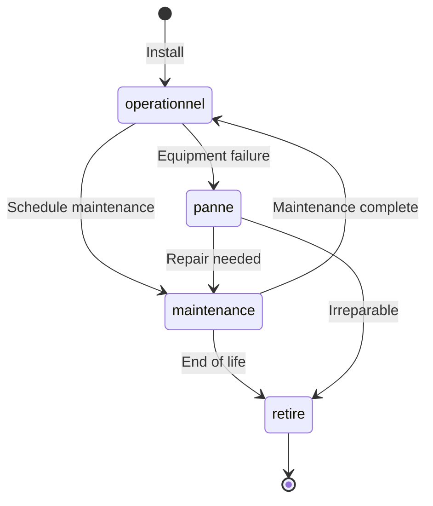

# ERP MIF Maroc - Entity Relationship Diagram & Data Model

## Data Model Overview

The ERP MIF Maroc data model is designed around the core business domain of **industrial maintenance management**. The model supports the complete lifecycle of maintenance interventions, from equipment tracking to technician assignment, work execution, and audit trail maintenance.

## Complete Entity Relationship Diagram

```mermaid
erDiagram
    %% Core User Management
    users {
        int id PK
        string username UK "Unique username"
        string full_name "Full display name"
        string email UK "Unique email address"
        string hashed_password "bcrypt hashed password"
        enum role "admin, responsable, technicien, client"
        boolean is_active "Account status"
        datetime created_at "Account creation timestamp"
        datetime updated_at "Last update timestamp"
    }
    
    %% Specialized User Types
    techniciens {
        int id PK
        int user_id FK,UK "One-to-one with users"
        string specialite "Technical specialization"
        enum disponibilite "disponible, occupe, conge, formation, indisponible"
        string equipe "Team assignment"
        string zone_geographique "Geographic work zone"
        text notes_competences "Competency notes"
        date date_embauche "Hire date"
        datetime created_at
        datetime updated_at
    }
    
    clients {
        int id PK
        int user_id FK,UK "One-to-one with users"
        string nom_entreprise "Company name"
        string secteur_activite "Business sector"
        enum type_client "premium, standard, basic"
        enum niveau_service "platinum, gold, standard, basic"
        text adresse "Full address"
        string ville "City"
        string code_postal "Postal code"
        string telephone "Phone number"
        string email_commercial "Commercial contact email"
        string contact_principal "Primary contact person"
        text notes_commerciales "Commercial notes"
        text instructions_particulieres "Special instructions"
        datetime created_at
        datetime updated_at
    }
    
    %% Equipment & Asset Management
    equipements {
        int id PK
        int client_id FK "Equipment owner"
        string nom "Equipment name"
        string modele "Model/type"
        string fabricant "Manufacturer"
        string numero_serie UK "Serial number"
        date date_installation "Installation date"
        enum statut "operationnel, maintenance, panne, retire"
        enum criticite "critique, haute, normale, basse"
        string localisation "Physical location"
        text specifications_techniques "Technical specifications"
        text manuel_utilisation "User manual/instructions"
        datetime derniere_maintenance "Last maintenance date"
        date prochaine_maintenance "Next scheduled maintenance"
        decimal cout_acquisition "Acquisition cost"
        string fournisseur "Supplier/vendor"
        datetime created_at
        datetime updated_at
    }
    
    %% Core Business Process - Interventions
    interventions {
        int id PK
        int equipement_id FK "Target equipment"
        int technicien_id FK "Assigned technician (nullable)"
        int client_id FK "Requesting client"
        enum type_intervention "corrective, preventive, ameliorative, diagnostic"
        enum statut "ouverte, affectee, en_cours, en_attente, cloturee, annulee, archivee"
        enum priorite "urgente, haute, normale, basse, programmee"
        boolean urgence "Emergency flag"
        string titre "Intervention title"
        text description "Detailed description"
        text diagnostic "Technical diagnosis"
        text solution "Solution implemented"
        datetime date_creation "Creation timestamp"
        datetime date_planifiee "Planned start date"
        datetime date_debut "Actual start time"
        datetime date_fin "Actual completion time"
        datetime date_limite "Deadline"
        decimal duree_estimee "Estimated duration (hours)"
        decimal duree_reelle "Actual duration (hours)"
        decimal cout_estime "Estimated cost"
        decimal cout_reel "Actual cost"
        text notes_techniques "Technical notes"
        int satisfaction_client "Client satisfaction (1-5)"
        datetime created_at
        datetime updated_at
    }
    
    %% Planning & Scheduling
    planning {
        int id PK
        int intervention_id FK,UK "One-to-one with intervention"
        datetime date_debut "Scheduled start time"
        datetime date_fin "Scheduled end time"
        string creneau "Time slot description"
        text notes_planning "Planning notes"
        boolean confirme "Confirmation status"
        boolean rappel_envoye "Reminder sent flag"
        datetime date_creation "Planning creation"
        datetime date_modification "Last modification"
    }
    
    %% Documentation Management
    documents {
        int id PK
        int intervention_id FK "Related intervention (nullable)"
        string nom_fichier "Original filename"
        string chemin "File storage path"
        string type_document "photo, rapport, manuel, certificat, facture"
        int taille "File size in bytes"
        text description "Document description"
        datetime date_upload "Upload timestamp"
        int uploaded_by FK "Uploading user"
        string mime_type "MIME type"
        string checksum "File integrity checksum"
    }
    
    %% Communication & Notifications
    notifications {
        int id PK
        int user_id FK "Recipient user"
        string titre "Notification title"
        text message "Notification content"
        enum type_notification "info, warning, error, success, intervention, planning"
        boolean lu "Read status"
        datetime date_envoi "Send timestamp"
        datetime date_lu "Read timestamp"
        int intervention_id FK "Related intervention (nullable)"
        json metadata "Additional notification data"
    }
    
    %% Competency Management
    competences {
        int id PK
        string nom "Competency name"
        text description "Competency description"
        enum niveau_requis "debutant, intermediaire, avance, expert"
        string certification "Required certification"
        boolean active "Competency status"
        datetime created_at
        datetime updated_at
    }
    
    technicien_competence {
        int technicien_id FK
        int competence_id FK
        enum niveau_acquis "debutant, intermediaire, avance, expert"
        date date_acquisition "Date competency acquired"
        date date_expiration "Competency expiration (nullable)"
        text notes "Additional notes"
        boolean certifie "Certification status"
    }
    
    %% Audit Trail & History
    historiques_interventions {
        int id PK
        int intervention_id FK "Related intervention"
        int user_id FK "User who made the change"
        enum action "creation, modification, affectation, changement_statut, debut_intervention, fin_intervention, ajout_commentaire, upload_document, planification, annulation"
        text description "Change description"
        json ancienne_valeur "Previous value (JSON)"
        json nouvelle_valeur "New value (JSON)"
        datetime horodatage "Change timestamp"
        inet adresse_ip "User IP address"
        text user_agent "User browser/client"
    }
    
    %% Commercial Management
    contrats {
        int id PK
        int client_id FK "Contract holder"
        string numero_contrat UK "Contract number"
        enum type_contrat "maintenance, support, full_service"
        enum statut "actif, expire, suspendu, resilie"
        date date_debut "Contract start date"
        date date_fin "Contract end date"
        decimal montant "Contract value"
        string devise "Currency"
        text conditions "Contract terms"
        text sla_details "Service Level Agreement"
        int nb_interventions_incluses "Included interventions"
        int nb_interventions_utilisees "Used interventions"
        datetime created_at
        datetime updated_at
    }
    
    factures {
        int id PK
        int client_id FK "Billing client"
        int contrat_id FK "Related contract (nullable)"
        string numero_facture UK "Invoice number"
        enum statut "brouillon, envoyee, payee, en_retard, annulee"
        date date_emission "Issue date"
        date date_echeance "Due date"
        date date_paiement "Payment date (nullable)"
        decimal montant_ht "Amount excluding tax"
        decimal taux_tva "VAT rate"
        decimal montant_ttc "Amount including tax"
        text description "Invoice description"
        string mode_paiement "Payment method"
        datetime created_at
        datetime updated_at
    }
    
    %% Inventory & Parts Management
    pieces_detachees {
        int id PK
        string reference UK "Part reference"
        string nom "Part name"
        text description "Part description"
        decimal prix_unitaire "Unit price"
        int stock_actuel "Current stock level"
        int stock_minimum "Minimum stock level"
        int stock_maximum "Maximum stock level"
        string unite "Unit of measure"
        string fournisseur "Supplier name"
        string emplacement "Storage location"
        boolean active "Part status"
        datetime created_at
        datetime updated_at
    }
    
    mouvements_stock {
        int id PK
        int piece_id FK "Related part"
        int intervention_id FK "Related intervention (nullable)"
        int user_id FK "User who made the movement"
        enum type_mouvement "entree, sortie, ajustement, transfert"
        int quantite "Quantity moved"
        decimal prix_unitaire "Unit price at movement"
        datetime date_mouvement "Movement timestamp"
        text commentaire "Movement notes"
        string bon_commande "Purchase order number"
        string bon_livraison "Delivery note number"
    }
    
    intervention_pieces {
        int intervention_id FK
        int piece_id FK
        int quantite "Quantity used"
        decimal prix_unitaire "Unit price"
        text notes "Usage notes"
        datetime date_utilisation "Usage timestamp"
    }
    
    %% Reporting & Analytics
    reports {
        int id PK
        string nom "Report name"
        enum type_report "interventions, performance, stock, facturation, client"
        enum format "pdf, excel, csv"
        json parametres "Report parameters"
        datetime date_generation "Generation timestamp"
        int generated_by FK "User who generated"
        string chemin_fichier "Generated file path"
        enum statut "en_cours, termine, erreur"
        text erreur_message "Error message if failed"
        datetime created_at
    }
    
    report_schedules {
        int id PK
        int report_id FK "Related report template"
        string nom_schedule "Schedule name"
        string cron_expression "Cron schedule expression"
        boolean active "Schedule status"
        json destinataires "Recipient list"
        datetime derniere_execution "Last execution time"
        datetime prochaine_execution "Next execution time"
        datetime created_at
        datetime updated_at
    }
    
    %% Many-to-Many Relationships
    users ||--o{ techniciens : "1:0..1"
    users ||--o{ clients : "1:0..1"
    users ||--o{ notifications : "1:many"
    users ||--o{ historiques_interventions : "1:many"
    users ||--o{ documents : "uploads"
    users ||--o{ mouvements_stock : "performs"
    users ||--o{ reports : "generates"
    
    techniciens ||--o{ interventions : "performs"
    techniciens }|--|| technicien_competence : "has"
    competences }|--|| technicien_competence : "required_by"
    
    clients ||--o{ equipements : "owns"
    clients ||--o{ contrats : "has"
    clients ||--o{ factures : "billed_to"
    clients ||--o{ interventions : "requests"
    
    equipements ||--o{ interventions : "requires"
    
    interventions ||--o{ planning : "scheduled_in"
    interventions ||--o{ documents : "documented_by"
    interventions ||--o{ historiques_interventions : "tracked_by"
    interventions }|--|| intervention_pieces : "consumes"
    interventions ||--o{ notifications : "triggers"
    
    contrats ||--o{ interventions : "covers"
    contrats ||--o{ factures : "generates"
    
    pieces_detachees ||--o{ mouvements_stock : "moved"
    pieces_detachees }|--|| intervention_pieces : "used_in"
    
    reports ||--o{ report_schedules : "scheduled_as"
```



## Core Domain Relationships

### User Management Domain

**Primary Entities**: `users`, `techniciens`, `clients`

**Relationships**:
- Users serve as the base authentication entity
- Techniciens and Clients extend users with role-specific attributes
- One-to-one relationships ensure data integrity
- Role-based access control is enforced at the user level

**Key Constraints**:
```sql
-- Ensure user role matches specialized entity
ALTER TABLE techniciens ADD CONSTRAINT chk_user_role_technicien 
CHECK (user_id IN (SELECT id FROM users WHERE role = 'technicien'));

ALTER TABLE clients ADD CONSTRAINT chk_user_role_client 
CHECK (user_id IN (SELECT id FROM users WHERE role = 'client'));
```

### Equipment & Asset Domain

**Primary Entities**: `equipements`

**Business Rules**:
- Each equipment belongs to exactly one client
- Serial numbers must be globally unique
- Equipment status affects intervention workflows
- Criticality levels influence intervention prioritization

**Lifecycle States**:


### Intervention Workflow Domain

**Primary Entities**: `interventions`, `planning`, `historiques_interventions`

**Core Workflow**:
1. **Creation**: Client or system creates intervention request
2. **Assignment**: Responsable assigns technician
3. **Planning**: Intervention is scheduled
4. **Execution**: Technician performs work on-site
5. **Completion**: Work is finished and validated
6. **Audit**: Complete trail of changes maintained

**State Machine Implementation**:
```sql
-- Intervention status transitions with validation
CREATE OR REPLACE FUNCTION validate_intervention_transition()
RETURNS TRIGGER AS $$
BEGIN
    -- Validate state transitions based on business rules
    CASE OLD.statut
        WHEN 'ouverte' THEN
            IF NEW.statut NOT IN ('affectee', 'annulee') THEN
                RAISE EXCEPTION 'Invalid transition from ouverte to %', NEW.statut;
            END IF;
        WHEN 'affectee' THEN
            IF NEW.statut NOT IN ('en_cours', 'ouverte', 'annulee') THEN
                RAISE EXCEPTION 'Invalid transition from affectee to %', NEW.statut;
            END IF;
        -- Additional validation logic...
    END CASE;
    
    RETURN NEW;
END;
$$ LANGUAGE plpgsql;

CREATE TRIGGER intervention_status_validation
    BEFORE UPDATE OF statut ON interventions
    FOR EACH ROW
    EXECUTE FUNCTION validate_intervention_transition();
```

## Data Integrity & Constraints

### Primary Key Strategy

**Auto-incrementing Integers**: All entities use `SERIAL PRIMARY KEY`
- Simple, efficient for PostgreSQL
- Supports high-volume inserts
- Compatible with ORM frameworks
- Avoids UUID overhead for internal system

### Foreign Key Relationships

**Cascade Strategies**:
```sql
-- User deletion cascades to related entities
ALTER TABLE techniciens ADD CONSTRAINT fk_technicien_user
    FOREIGN KEY (user_id) REFERENCES users(id) ON DELETE CASCADE;

-- Equipment deletion cascades to interventions
ALTER TABLE interventions ADD CONSTRAINT fk_intervention_equipement
    FOREIGN KEY (equipement_id) REFERENCES equipements(id) ON DELETE CASCADE;

-- Soft deletion for audit preservation
ALTER TABLE interventions ADD CONSTRAINT fk_intervention_technicien
    FOREIGN KEY (technicien_id) REFERENCES techniciens(id) ON DELETE SET NULL;
```

### Business Rule Constraints

**Data Validation**:
```sql
-- Date consistency validation
ALTER TABLE interventions ADD CONSTRAINT chk_intervention_dates
    CHECK (
        (date_fin IS NULL OR date_debut IS NULL OR date_fin >= date_debut) AND
        (date_limite IS NULL OR date_limite >= date_creation)
    );

-- Stock level validation
ALTER TABLE pieces_detachees ADD CONSTRAINT chk_stock_levels
    CHECK (
        stock_actuel >= 0 AND
        stock_minimum >= 0 AND
        stock_maximum >= stock_minimum
    );

-- Client satisfaction rating
ALTER TABLE interventions ADD CONSTRAINT chk_satisfaction_range
    CHECK (satisfaction_client IS NULL OR (satisfaction_client >= 1 AND satisfaction_client <= 5));
```

## Performance Optimization

### Strategic Indexing

**Query Performance Indexes**:
```sql
-- Authentication and user queries
CREATE INDEX idx_user_email_active ON users(email, is_active);
CREATE INDEX idx_user_username_role ON users(username, role);

-- Intervention workflow queries
CREATE INDEX idx_intervention_statut_date ON interventions(statut, date_creation);
CREATE INDEX idx_intervention_technicien_statut ON interventions(technicien_id, statut);
CREATE INDEX idx_intervention_equipement_date ON interventions(equipement_id, date_creation);

-- Equipment management queries
CREATE INDEX idx_equipement_client_statut ON equipements(client_id, statut);
CREATE INDEX idx_equipement_criticite_maintenance ON equipements(criticite, prochaine_maintenance);

-- Notification filtering
CREATE INDEX idx_notification_user_lu ON notifications(user_id, lu);
CREATE INDEX idx_notification_date_type ON notifications(date_envoi, type_notification);

-- Audit trail queries
CREATE INDEX idx_historique_intervention_date ON historiques_interventions(intervention_id, horodatage);
CREATE INDEX idx_historique_user_action ON historiques_interventions(user_id, action);
```

**Partial Indexes for Efficiency**:
```sql
-- Index only active/relevant records
CREATE INDEX idx_active_users ON users(role) WHERE is_active = TRUE;
CREATE INDEX idx_open_interventions ON interventions(priorite, date_creation) 
    WHERE statut IN ('ouverte', 'affectee', 'en_cours');
CREATE INDEX idx_unread_notifications ON notifications(user_id, date_envoi) 
    WHERE lu = FALSE;
```

### Materialized Views for Reporting

**Performance-Critical Aggregations**:
```sql
-- Intervention statistics by technician
CREATE MATERIALIZED VIEW mv_technician_stats AS
SELECT 
    t.id as technician_id,
    t.user_id,
    u.username,
    COUNT(i.id) as total_interventions,
    COUNT(CASE WHEN i.statut = 'cloturee' THEN 1 END) as completed_interventions,
    AVG(CASE WHEN i.duree_reelle IS NOT NULL THEN i.duree_reelle END) as avg_duration,
    AVG(CASE WHEN i.satisfaction_client IS NOT NULL THEN i.satisfaction_client END) as avg_satisfaction
FROM techniciens t
JOIN users u ON t.user_id = u.id
LEFT JOIN interventions i ON t.id = i.technicien_id
GROUP BY t.id, t.user_id, u.username;

-- Client equipment summary
CREATE MATERIALIZED VIEW mv_client_equipment_summary AS
SELECT 
    c.id as client_id,
    c.nom_entreprise,
    COUNT(e.id) as total_equipment,
    COUNT(CASE WHEN e.statut = 'operationnel' THEN 1 END) as operational_equipment,
    COUNT(CASE WHEN e.statut = 'panne' THEN 1 END) as failed_equipment,
    COUNT(CASE WHEN e.criticite = 'critique' THEN 1 END) as critical_equipment
FROM clients c
LEFT JOIN equipements e ON c.id = e.client_id
GROUP BY c.id, c.nom_entreprise;

-- Refresh strategy
CREATE OR REPLACE FUNCTION refresh_materialized_views()
RETURNS void AS $$
BEGIN
    REFRESH MATERIALIZED VIEW mv_technician_stats;
    REFRESH MATERIALIZED VIEW mv_client_equipment_summary;
END;
$$ LANGUAGE plpgsql;
```

## Data Quality & Validation

### Enum Consistency

**Standardized Enumerations**:
```sql
-- User roles
CREATE TYPE user_role AS ENUM ('admin', 'responsable', 'technicien', 'client');

-- Intervention workflow
CREATE TYPE intervention_type AS ENUM ('corrective', 'preventive', 'ameliorative', 'diagnostic');
CREATE TYPE statut_intervention AS ENUM ('ouverte', 'affectee', 'en_cours', 'en_attente', 'cloturee', 'annulee', 'archivee');
CREATE TYPE priorite_intervention AS ENUM ('urgente', 'haute', 'normale', 'basse', 'programmee');

-- Equipment management
CREATE TYPE statut_equipement AS ENUM ('operationnel', 'maintenance', 'panne', 'retire');
CREATE TYPE criticite_equipement AS ENUM ('critique', 'haute', 'normale', 'basse');

-- Technician availability
CREATE TYPE disponibilite_technicien AS ENUM ('disponible', 'occupe', 'conge', 'formation', 'indisponible');
```

### Data Consistency Rules

**Cross-Table Validation**:
```sql
-- Ensure intervention client matches equipment owner
CREATE OR REPLACE FUNCTION validate_intervention_client()
RETURNS TRIGGER AS $$
BEGIN
    IF NEW.client_id != (SELECT client_id FROM equipements WHERE id = NEW.equipement_id) THEN
        RAISE EXCEPTION 'Intervention client must match equipment owner';
    END IF;
    RETURN NEW;
END;
$$ LANGUAGE plpgsql;

CREATE TRIGGER intervention_client_validation
    BEFORE INSERT OR UPDATE ON interventions
    FOR EACH ROW
    EXECUTE FUNCTION validate_intervention_client();
```

## Temporal Data Management

### Audit Trail Strategy

**Complete Change Tracking**:
- All modifications to interventions are logged in `historiques_interventions`
- JSON fields store before/after values for detailed change tracking
- User context (IP, user agent) preserved for security analysis
- Immutable audit records (no updates allowed)

**Audit Trigger Implementation**:
```sql
CREATE OR REPLACE FUNCTION log_intervention_changes()
RETURNS TRIGGER AS $$
BEGIN
    INSERT INTO historiques_interventions (
        intervention_id,
        user_id,
        action,
        description,
        ancienne_valeur,
        nouvelle_valeur,
        horodatage
    ) VALUES (
        COALESCE(NEW.id, OLD.id),
        current_setting('app.current_user_id', true)::integer,
        TG_OP::text,
        CASE TG_OP
            WHEN 'INSERT' THEN 'Création intervention'
            WHEN 'UPDATE' THEN 'Modification intervention'
            WHEN 'DELETE' THEN 'Suppression intervention'
        END,
        CASE TG_OP WHEN 'DELETE' THEN row_to_json(OLD) ELSE NULL END,
        CASE TG_OP WHEN 'INSERT' THEN row_to_json(NEW) ELSE row_to_json(NEW) END,
        NOW()
    );
    
    RETURN COALESCE(NEW, OLD);
END;
$$ LANGUAGE plpgsql;

CREATE TRIGGER intervention_audit_trigger
    AFTER INSERT OR UPDATE OR DELETE ON interventions
    FOR EACH ROW
    EXECUTE FUNCTION log_intervention_changes();
```

### Data Retention Policies

**Automated Cleanup**:
```sql
-- Archive old completed interventions
CREATE OR REPLACE FUNCTION archive_old_interventions()
RETURNS void AS $$
BEGIN
    UPDATE interventions 
    SET statut = 'archivee' 
    WHERE statut = 'cloturee' 
    AND date_fin < CURRENT_DATE - INTERVAL '2 years';
    
    -- Clean old notifications
    DELETE FROM notifications 
    WHERE date_envoi < CURRENT_DATE - INTERVAL '6 months' 
    AND lu = TRUE;
    
    -- Clean old audit logs (keep 3 years)
    DELETE FROM historiques_interventions 
    WHERE horodatage < CURRENT_DATE - INTERVAL '3 years';
END;
$$ LANGUAGE plpgsql;
```

## Data Migration Strategy

### Schema Evolution

**Version-Controlled Migrations**:
- Alembic manages all schema changes
- Each migration includes both upgrade and downgrade paths
- Data migrations separated from schema migrations
- Production rollback procedures documented

**Migration Best Practices**:
```sql
-- Example migration with data preservation
-- Revision: add_equipment_warranty
-- Revises: previous_revision

-- Upgrade
ALTER TABLE equipements ADD COLUMN date_fin_garantie DATE;
ALTER TABLE equipements ADD COLUMN duree_garantie_mois INTEGER;

-- Populate with calculated values
UPDATE equipements 
SET date_fin_garantie = date_installation + INTERVAL '24 months',
    duree_garantie_mois = 24
WHERE date_installation IS NOT NULL;

-- Downgrade  
ALTER TABLE equipements DROP COLUMN date_fin_garantie;
ALTER TABLE equipements DROP COLUMN duree_garantie_mois;
```

---

*This ERD documentation provides a comprehensive view of the ERP MIF Maroc data model, relationships, constraints, and optimization strategies for efficient maintenance workflow management.*