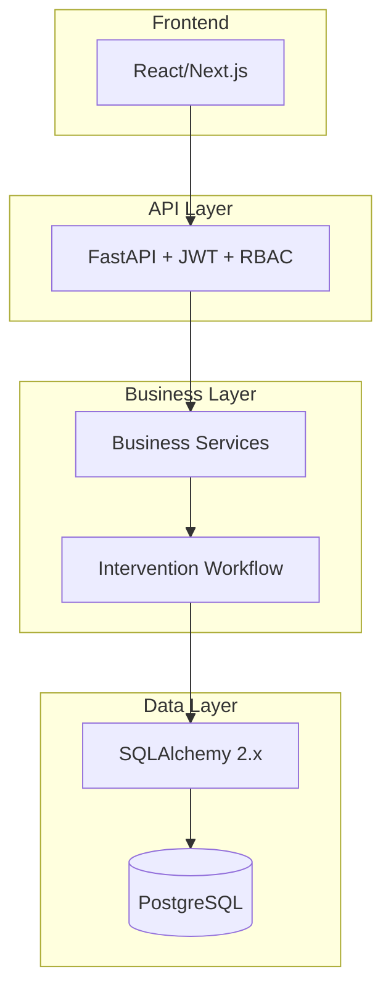
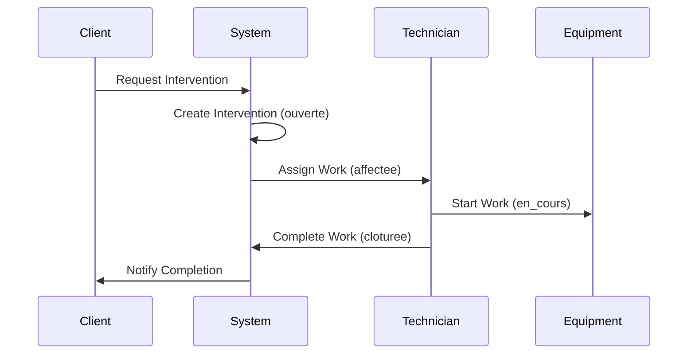

# ERP MIF Maroc - Documentation Suite

Welcome to the comprehensive documentation for the ERP MIF Maroc backend system. This documentation suite provides complete coverage of architecture, implementation, and operational procedures for the industrial maintenance management system.

## 📚 Documentation Structure

### 00-FOUNDATION - Core Foundation (7 documents)
Essential system foundation and architecture documentation.

- **[PROJECT_OVERVIEW.md](00-FOUNDATION/PROJECT_OVERVIEW.md)** - Complete project overview and business context
- **[ARCHITECTURE.md](00-FOUNDATION/ARCHITECTURE.md)** - System architecture and design patterns  
- **[ENVIRONMENT.md](00-FOUNDATION/ENVIRONMENT.md)** - Environment setup and configuration
- **[DATABASE.md](00-FOUNDATION/DATABASE.md)** - Database structure and management
- **[MIGRATIONS_ALEMBIC.md](00-FOUNDATION/MIGRATIONS_ALEMBIC.md)** - Database migration guide
- **[SECURITY_AUTH_RBAC.md](00-FOUNDATION/SECURITY_AUTH_RBAC.md)** - Security and authorization
- **[API_CONVENTIONS.md](00-FOUNDATION/API_CONVENTIONS.md)** - API design standards
- **[TESTING_QA.md](00-FOUNDATION/TESTING_QA.md)** - Testing strategy and QA

### 10-SERVICES - Business Services (2 documents)
Core business domain service documentation.

- **[AUTH.md](10-SERVICES/AUTH.md)** - Authentication service implementation
- **[INTERVENTIONS.md](10-SERVICES/INTERVENTIONS.md)** - Core intervention workflow service

### 20-DATA - Data Model (1 document)
Data structure and relationship documentation.

- **[ERD_MODEL.md](20-DATA/ERD_MODEL.md)** - Complete entity relationship diagram and data model

### 30-API - API Documentation (1 document)
API usage and integration guides.

- **[OPENAPI_GUIDE.md](30-API/OPENAPI_GUIDE.md)** - OpenAPI usage and integration guide

### 99-PROJECT - Project Management (2 documents)
Project documentation and reference materials.

- **[CHANGELOG.md](99-PROJECT/CHANGELOG.md)** - Version history and release notes
- **[GLOSSARY.md](99-PROJECT/GLOSSARY.md)** - Complete terminology and definitions

## 🚀 Quick Start

1. **For Developers**: Start with [PROJECT_OVERVIEW.md](00-FOUNDATION/PROJECT_OVERVIEW.md) and [ARCHITECTURE.md](00-FOUNDATION/ARCHITECTURE.md)
2. **For Operations**: Review [ENVIRONMENT.md](00-FOUNDATION/ENVIRONMENT.md) and [DATABASE.md](00-FOUNDATION/DATABASE.md)
3. **For Integration**: Check [API_CONVENTIONS.md](00-FOUNDATION/API_CONVENTIONS.md) and [OPENAPI_GUIDE.md](30-API/OPENAPI_GUIDE.md)
4. **For Business**: Refer to [INTERVENTIONS.md](10-SERVICES/INTERVENTIONS.md) and [GLOSSARY.md](99-PROJECT/GLOSSARY.md)

## 📊 Documentation Statistics

- **Total Documents**: 14 comprehensive guides
- **Total Content**: 8,882+ lines of documentation
- **Coverage Areas**: Foundation, Services, Data, API, Project Management
- **Languages**: English with French business terminology
- **Format**: Markdown with Mermaid diagrams and code examples

## 🎯 Key Features Documented

### ✅ Complete System Coverage
- **Architecture**: Layered architecture with clear separation of concerns
- **Database**: PostgreSQL with SQLAlchemy 2.x ORM and Alembic migrations
- **API**: RESTful API with OpenAPI/Swagger documentation
- **Security**: JWT authentication with RBAC authorization
- **Testing**: 97.27% test coverage with comprehensive test strategies

### ✅ Business Domain Coverage
- **Intervention Management**: Complete maintenance workflow system
- **Equipment Tracking**: Asset management and status monitoring
- **User Management**: Multi-role user system with specialization
- **Document Management**: File upload and document handling
- **Audit Trail**: Complete change tracking and history

### ✅ Technical Implementation
- **FastAPI**: Modern async web framework with automatic OpenAPI
- **Docker**: Development environment with hot reload
- **Type Safety**: Full type hints with Pydantic validation
- **Performance**: Optimized queries with strategic indexing
- **Quality**: Comprehensive testing and code quality tools

## 🔧 Technology Stack

| Component | Technology | Version | Purpose |
|-----------|------------|---------|---------|
| **Web Framework** | FastAPI | 0.110+ | High-performance async API |
| **Database** | PostgreSQL | 16+ | Primary data store |
| **ORM** | SQLAlchemy | 2.x | Database abstraction |
| **Migrations** | Alembic | Latest | Schema versioning |
| **Authentication** | JWT | - | Token-based auth |
| **Validation** | Pydantic | 2.6+ | Request/response validation |
| **Testing** | Pytest | Latest | Test framework |
| **Containers** | Docker Compose | Latest | Development environment |

## 📝 Documentation Standards

### Writing Guidelines
- **Clear Structure**: Hierarchical organization with consistent formatting
- **Code Examples**: Real, working examples with explanations
- **Diagrams**: Mermaid diagrams for visual representation
- **Cross-References**: Linked documentation for easy navigation

### Maintenance
- **Version Control**: All documentation version controlled with code
- **Updates**: Regular updates with each feature release
- **Review Process**: Technical review for accuracy and completeness
- **Feedback**: Community feedback integration for continuous improvement

## 🏗️ Architecture Highlights

### System Design

### Core Business Flow

## 📚 Additional Resources

### API Documentation
- **Swagger UI**: `http://localhost:8000/docs`
- **ReDoc**: `http://localhost:8000/redoc`
- **OpenAPI JSON**: `http://localhost:8000/openapi.json`

### Development Tools
- **Health Check**: `GET /health`
- **Root Endpoint**: `GET /`
- **Static Files**: `/static/uploads`

### Support
- **Repository**: [FastApi_ERP_BackEnd_MIF_Maroc](https://github.com/Rochdi112/FastApi_ERP_BackEnd_MIF_Maroc)
- **Author**: Sabir Rochdi - MIF Maroc
- **Contact**: backend-team@mif-maroc.com

---

*This documentation suite provides everything needed to understand, develop, deploy, and maintain the ERP MIF Maroc system. For specific questions or updates, please refer to the appropriate section or contact the development team.*